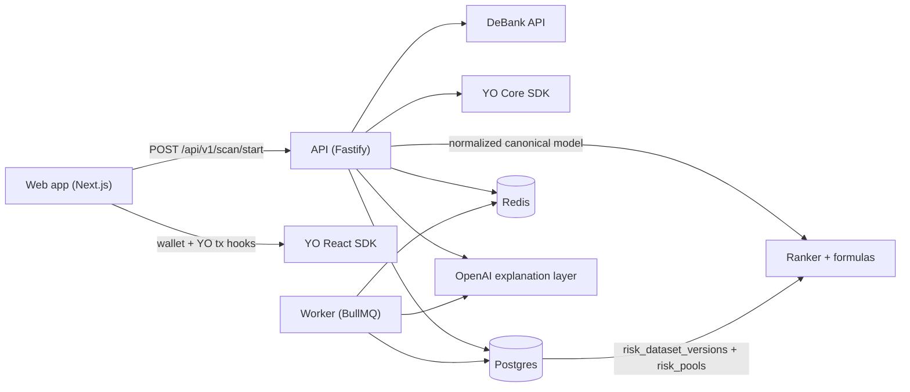

# Architecture

## Overview

## Service split

- `apps/web`: thin client, wallet connect, scan trigger, recommendation rendering, YO deposit UI.
- `apps/api`: deterministic recommendation engine, normalization, matching, metrics, ranking, persistence.
- `apps/worker`: async explanation jobs and cache population.

## Canonical model

The system normalizes all external inputs into:

- canonical token exposures
- canonical protocol exposures
- canonical user portfolio
- canonical YO vaults
- bucket metrics
- ranked recommendations

These contracts live in [packages/shared/src/schemas.ts](../packages/shared/src/schemas.ts).

## Data flow

1. Wallet connects in the web app.
2. Frontend calls `POST /api/v1/scan/start`.
3. API loads DeBank wallet data, YO vault read data, risk dataset rows, and protocol aliases.
4. API normalizes positions into canonical exposures.
5. API computes bucket metrics and YO vault metrics with deterministic formulas.
6. Ranker produces bucket-specific recommendations.
7. Explanation layer receives only compact structured inputs.
8. API persists `scan_sessions`, `scan_bucket_metrics`, and `scan_recommendations`.
9. Web renders ranked results and opens YO deposit flow inline.

## Matching strategy

Matching order:

1. explicit protocol ids / addresses
2. normalized exact string match
3. alias table
4. bucket-aware and chain-aware heuristics
5. strategy-aware fallback

LLM is not used in hot-path matching.

## Risk dataset

Bootstrap imports the raw JSON file into:

- `risk_dataset_versions` for raw payload and checksum tracking
- `risk_pools`, `risk_pool_assets`, `risk_blockchains` for runtime analytics

Runtime scan requests read normalized rows from Postgres and optional Redis caches, not from the raw file.

## YO SDK split

- Backend uses `@yo-protocol/core` through [yo-vault-read-service.ts](../apps/api/src/services/yo-vault-read-service.ts).
- Frontend uses `@yo-protocol/react` through [yo-sdk.tsx](../apps/web/lib/yo-sdk.tsx) and [yo-deposit-drawer.tsx](../apps/web/components/yo-deposit-drawer.tsx).

## Degraded modes

- If YO SDK read path fails, API falls back to normalized `yo_pools` rows from the active risk dataset and surfaces a warning.
- If OpenAI is unavailable, explanation text falls back to deterministic templates.
- If DeBank credentials are absent, the API returns an empty portfolio instead of crashing.
